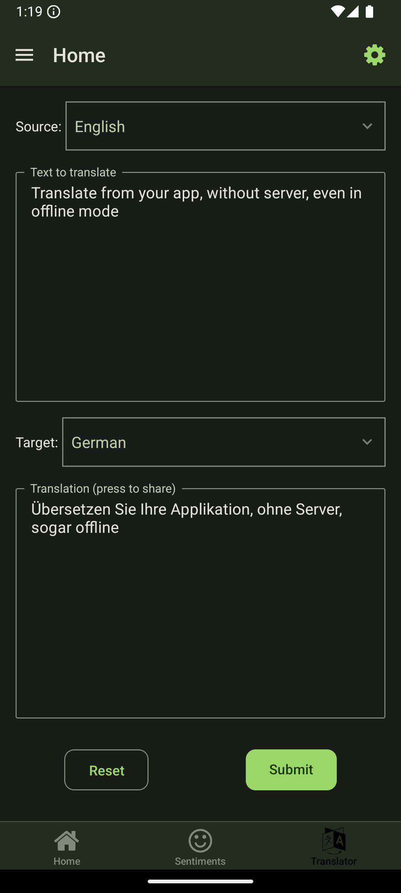
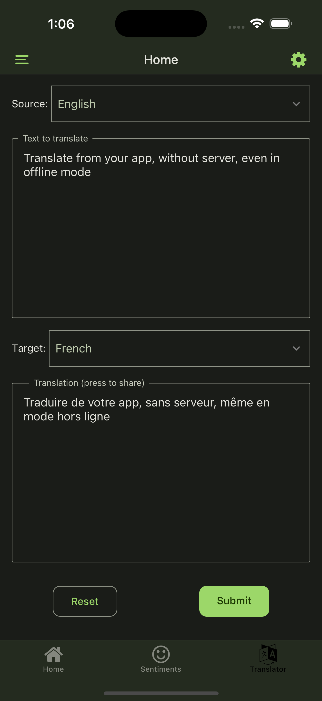
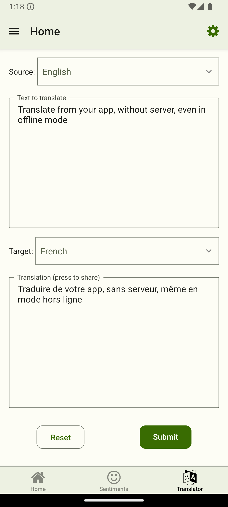
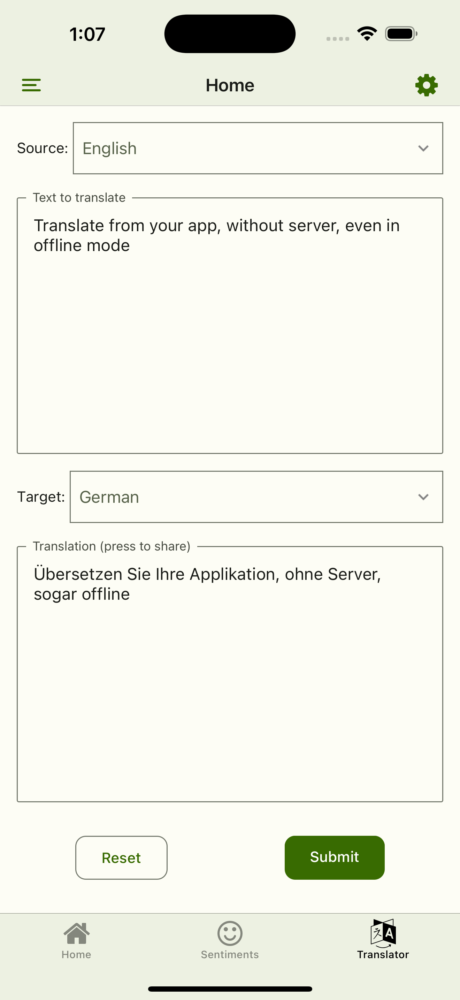

# poc-archiver-expo

## 📱 POC Archiver Expo - React Native Proof of Concepts Collection

**POC Archiver Expo** is a comprehensive mobile application built with **React Native** and **Expo SDK** that serves as a sandbox for testing and demonstrating various advanced features.

### 🚀 Key Features

#### 🤖 **Artificial Intelligence & Machine Learning**
- **Text Translation**: Offline multilingual translation using Transformer.js
- **Sentiment Analysis**: Text classification and emotional analysis
- **Object Detection**: Image object recognition with ONNX models
- **Feature Extraction**: Semantic search in code documents

#### 📄 **Document Management**
- **PDF Text Extraction**: Using PDF.js in WebView to extract textual content
- **Content Display**: Document rendering with syntax highlighting

#### 🎨 **Advanced User Interface**
- **Adaptive Theme**: Light/dark mode support with MobX
- **Material Design**: Interface using react-native-paper
- **Smooth Animations**: Using react-native-reanimated

#### 🔧 **Technical Features**
- **State Management**: MobX for global state management
- **Network Queries**: Tanstack Query for data management
- **OTA Updates**: Over-the-air update system with Expo Updates

#### 🧪 **Experiments & POCs**
- **API Routes**: Expo API routes demonstration
- **Integrated WebView**: Web content integration in the app
- **Custom Selectors**: Advanced selection components
- **Toast Notifications**: Notification system with sonner-native

### 🏗 Technical Architecture

- **Framework**: React Native with Expo SDK
- **Navigation**: Expo Router with typed routes
- **Global State**: MobX with react-lite
- **UI Components**: React Native Paper + custom components
- **ML/AI**: Transformer.js, ONNX Runtime, @fugood/transformers
- **Storage**: MMKV for sensitive data
- **Validation**: Zod for runtime validation

### 🎯 Use Cases

This application is ideal for:
- **Developers** wanting to explore AI capabilities in React Native
- **Teams** seeking to validate technical concepts before production
- **Learners** wanting to understand advanced technology integration

### 📱 Multi-Platform Support

- ✅ **iOS** (iPhone & iPad)
- ✅ **Android** (phones & tablets)

This POC collection demonstrates the advanced capabilities of React Native and Expo, providing a solid foundation for exploration and innovation in modern mobile development.

---

Expo SDK Proof of concepts collection

     

## Some screen captures

| Android Dark                                                                   | iOS Dark                                                                   | Android Light                                                                  | iOS Light                                                                  |
|--------------------------------------------------------------------------------|----------------------------------------------------------------------------|--------------------------------------------------------------------------------|----------------------------------------------------------------------------|
|  |  |  |  |

## Scripts

| Command                              | Description                                                                     |
|--------------------------------------|---------------------------------------------------------------------------------|
| `yarn android`                       | Build & run the Expo project on an `Android` device or emulator.                |
| `yarn ios`                           | Build & run the Expo project on an `iOS` device or simulator.                   |
| `yarn start`                         | Start the `Expo` development server.                                            |
| `yarn lint`                          | Run linter to check for code style and formatting issues.                       |
| `yarn format`                        | Run linter to automatically fix code style and formatting issues.               |
| `yarn expo:doctor`                   | Run Expo's doctor command to diagnose issues in the project.                    |
| `yarn expo:install:fix`              | Update Expo dependencies to the latest versions                                 |
| `yarn eas:build:ios:preview`         | Build `iOS` preview using EAS.                                                  |
| `yarn eas:build:ios:development`     | Build `iOS` development using EAS.                                              |
| `yarn eas:build:android:preview`     | Build `Android` preview using EAS.                                              |
| `yarn eas:build:android:development` | Build `Android` development using EAS.                                          |
| `yarn eas:run:ios`                   | Run the latest `EAS iOS build`.                                                 |
| `yarn eas:run:android`               | Run the latest `EAS Android build`.                                             |
| `eas:update:ios:preview`             | Publish an OTA `iOS` preview update with changes from project                   |
| `eas:update:android:preview`         | Publish an OTA `Android` preview update with changes from project               |
| `yarn generate:version`              | Generate version infos (see `src/constants.ts`)                                 |
| `yarn postinstall`                   | Run `patch-package` and `npm-license-crawler` after dependencies are installed. |

## Project coding guidelines

Adhering to established coding guidelines is essential for developing efficient, maintainable, and scalable software. These guidelines promote consistency across codebases, making it easier for teams to collaborate and for new developers to understand existing code. By following standardized patterns, such as those outlined in the [Coding guidelines](https://github.com/amwebexpert/chrome-extensions-collection/blob/master/packages/coding-guide-helper/public/markdowns/table-of-content.md), developers can reduce errors and enhance code readability.

* [Coding guidelines](https://github.com/amwebexpert/chrome-extensions-collection/blob/master/packages/coding-guide-helper/public/markdowns/table-of-content.md)

## References

- [Transformer.js & ONNX Runtime](https://docs.google.com/document/d/1HFsJIK97eaktqOj5au0DIa4gtvGvN9ojnef0uNQ6H2I/edit?usp=sharing)
- [IA model inference at 0$](https://github.com/amwebexpert/chrome-extensions-collection/tree/master/packages/coding-guide-helper#semantic-search)
- [WASM example](https://github.com/amwebexpert/chrome-extensions-collection)

### Builds for iOS Simulator

- https://docs.expo.dev/develop/development-builds/create-a-build/#create-a-build-for-emulatorsimulator
- https://docs.expo.dev/build-reference/simulators/#installing-build-on-the-simulator

### OTA updates on Android devices

`eas update --channel preview --platform android --message "OTA detail message here..."` 

### ONNX Runtime for RN (early access PR ref.)

- https://github.com/hans00/react-native-transformers-example
- https://github.com/huggingface/transformers.js/pull/118

### Incoming steps (drawer integration)

- https://github.com/openspacelabs/react-native-zoomable-view/issues/61
- https://www.npmjs.com/package/@openspacelabs/react-native-zoomable-view

### TODOs

- PocArchiverExpo-0001
  - improve model loading progress Typescript types and UI progress bar

### iOS Simulator tips

#### Deactivate WiFi and Cellular Mode

    xcrun simctl list devices
    xcrun simctl status_bar 6A716C79-D944-4243-B92B-1D9027E18E4E override --wifiBars 0
    xcrun simctl status_bar 6A716C79-D944-4243-B92B-1D9027E18E4E override --cellularBars 0
    xcrun simctl status_bar 6A716C79-D944-4243-B92B-1D9027E18E4E clear

## Upgrade Expo SDK process

* run `npx expo install expo@latest` to upgrade to the latest Expo SDK
* run `npx expo install --check` to list latest versions of all expo dependencies. This will automatically ask to upgrade to the expected dependencies (if any)
  * expected result: `Dependencies are up to date`
* check other non-Expo dependencies (you need ncu utility which can be installed globally `yarn global add npm-check-updates`)
  * `ncu -u`
  * then re-run again `npx expo install --check` and accept Expo specific version suggestions
* remove the node_modules and yarn.lock all together and re-install all dependencies
  * `yarn clean:node`
  * `yarn`
* run `npx expo-doctor` to see if any dependency is not expected as part of the current Expo SDK major version. This will also list the command to upgrade the unaligned dependencies
  * expected result: `15/15 checks passed. No issues detected!`
* clean and re-generate the prebuild folders for `iOS` and `Android` platforms
  * `npx expo prebuild --clean`
* Test the development build
  * run `npx expo run:ios` and test on the `iOS Simulator`
  * run `npx expo run:android` and test on the `Android simulator`
### References
- [How to upgrade from Expo SDK X to Y](https://www.youtube.com/watch?v=HBPyP4OxVgs)